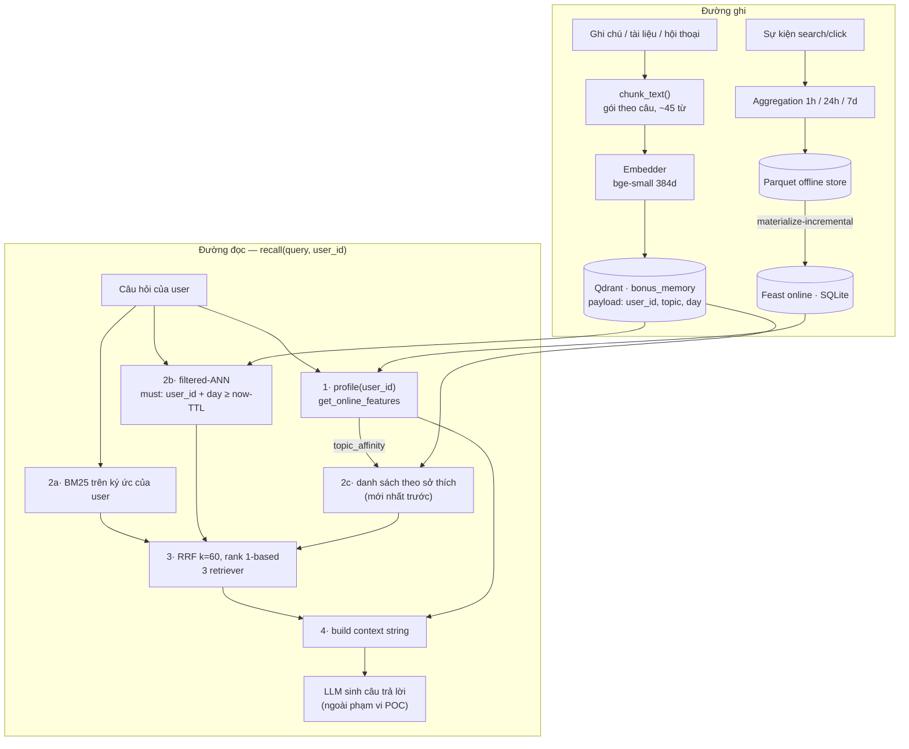

# Hybrid Memory — kiến trúc bộ nhớ cho trợ lý AI cá nhân (tiếng Việt)

**Tác giả:** Nguyễn Khắc Huy — 2A202602036 (làm một mình, không pair)
**POC:** `bonus/agent.py` (`HybridMemoryAgent.remember()` / `.recall()`) · `bonus/demo.py`
**Bối cảnh:** trợ lý cá nhân cho kỹ sư Việt Nam — đọc tài liệu kỹ thuật, ghi chú
nhanh, hỏi lại sau vài tuần. Ngôn ngữ thật của nhóm người dùng này là **vi/en
trộn lẫn trong cùng một câu**, và đó là ràng buộc chi phối gần hết các quyết định
dưới đây.

---

## 1. Sơ đồ kiến trúc

Hai kho trả lời **hai câu hỏi khác nhau**: feature store trả lời *"user này là
ai"*, vector store trả lời *"cái gì liên quan"*. Chúng gặp nhau đúng một chỗ —
`recall()` — và `topic_affinity` từ feature store trở thành **retriever thứ ba**
trong RRF chứ không phải hệ số nhân lên điểm.

---

## 2. Ba quyết định kiến trúc

### Quyết định 1 — Chunking: gói theo câu ~45 từ, không phải per-message

**Chọn:** cắt theo ranh giới câu, gộp các câu liên tiếp cho tới ~45 từ
(`chunk_text()` trong `agent.py`). Một ghi chú điển hình ra 1–2 chunk.

**Đánh đổi so với per-message:** per-message là lựa chọn mặc định của hầu hết
tutorial vì nó đơn giản. Nhưng tin nhắn thật của người dùng dài 5–10 từ; embed
một câu 8 từ cho ra vector bị chi phối bởi từ chức năng, và một ghi chú bị xé
thành nhiều điểm gần trùng nhau khiến top-k bị một ghi chú duy nhất chiếm hết
chỗ. Đổi lại, per-message cho *citation* chính xác đến từng câu — thứ mà cách
của tôi mất đi một phần.

**Đánh đổi so với per-conversation:** một vector cho cả cuộc hội thoại là rẻ
nhất về lưu trữ (ít điểm nhất) nhưng rơi đúng vào cái bẫy đã thấy ở NB6: một
embedding của nội dung nhiều ý định nằm ở *khoảng giữa* các cụm — gần tất cả,
thuộc về không cụm nào. Recall sập trên đúng loại câu hỏi mà người dùng hay hỏi
nhất ("tôi đọc gì về X").

**Đánh đổi so với cửa sổ token cố định (512 token, overlap 64):** đây mới là
lựa chọn tôi cân nhắc lâu nhất, vì nó là chuẩn công nghiệp. Lý do loại: cửa sổ
token cố định **cắt giữa câu**, và với tiếng Việt tokenizer của model là
subword tiếng Anh nên điểm cắt rơi vào giữa một từ ghép ("tự động | mở rộng")
thường xuyên hơn hẳn so với tiếng Anh. Ranh giới câu thì độc lập ngôn ngữ và
miễn phí.

**Chi phí:** ~45 từ/chunk ⇒ 1000 ghi chú ≈ 1500 chunk ≈ 1500 × 384 × 4 B ≈
**2,3 MB vector**. Không đáng kể. Về context window, top-3 chunk ≈ 135 từ —
vừa đủ để nhét vào prompt cùng hồ sơ mà không ăn hết ngân sách token.

### Quyết định 2 — Feature schema: tabular trước, embedding feature sau

| Feature | Entity | TTL | Nguồn | Nhịp làm mới |
|---|---|---|---|---|
| `topic_affinity` | `user` | 30 ngày | batch từ log click | hằng ngày |
| `preferred_language` | `user` | 30 ngày | batch | hằng ngày |
| `reading_speed_wpm` | `user` | 30 ngày | batch từ dwell time | hằng ngày |
| `queries_last_hour` | `user` | 1 giờ | streaming | gần thời gian thực |
| `distinct_topics_24h` | `user` | 1 giờ | streaming | gần thời gian thực |

**Chọn tabular** (đúng 5 cột trên, tái dùng nguyên `user_profile_features` +
`query_velocity_features` của NB4) **thay vì embedding feature** (một vector
latent 384d học từ lịch sử user).

**Đánh đổi:** embedding feature mạnh hơn thật — nó bắt được sở thích không tên
được, kiểu "user này thích tài liệu có code hơn tài liệu khái niệm", thứ mà một
cột `topic_affinity` với 10 giá trị không bao giờ biểu diễn nổi. Cái giá là:
(1) không debug được — khi cá nhân hoá sai, không ai nhìn vào 384 số mà biết vì
sao; (2) **đổi embedding model ⇒ phải backfill lại toàn bộ lịch sử feature**,
và PIT join trên feature đã backfill là một cách rò rỉ dữ liệu rất khó phát
hiện; (3) TTL trở nên vô nghĩa vì vector không "cũ" một cách nhìn thấy được.
Với một POC mà việc chính là *chứng minh hai kho ghép được với nhau*, cột tabular
đọc được bằng mắt có giá trị hơn vài điểm recall.

### Quyết định 3 — Freshness: ba use case, ba nhịp khác nhau

Câu hỏi "sau khi user vừa đọc xong một tài liệu, bao lâu thì `recall()` phản ánh
nó?" **không có một câu trả lời** — nó có ba, tuỳ đường dữ liệu:

1. **Ký ức episodic (vector store) — tức thì, sub-second.** `remember()` upsert
   thẳng vào Qdrant; tài liệu vừa đọc xong tìm lại được ngay câu hỏi kế tiếp.
   Không có batch nào ở giữa, vì trễ ở đây là thứ người dùng *cảm nhận trực tiếp*
   ("tôi vừa lưu mà nó bảo không biết").
2. **Recent activity (`queries_last_hour`) — streaming, mục tiêu < 5 giây.**
   Feature này chỉ có ý nghĩa khi nó tươi; TTL 1 giờ trong NB4 phản ánh đúng
   điều đó. Nếu chỉ chạy batch 5 phút, câu hỏi "tôi đang quan tâm gì" trả lời
   bằng dữ liệu của 5 phút trước — sai một cách khó chịu nhưng không ai báo lỗi.
   Đây là chỗ duy nhất tôi chấp nhận trả giá vận hành cho một Push API.
3. **Hồ sơ ổn định (`topic_affinity`, `reading_speed_wpm`) — batch hằng ngày.**
   Sở thích dịch chuyển theo tuần. Cập nhật theo phút vừa tốn tiền vừa **có
   hại**: một buổi tối đọc lệch chủ đề sẽ kéo cá nhân hoá đi trong khi nó chỉ là
   nhiễu. Batch hằng ngày ở đây là một bộ lọc thông thấp, không phải sự lười.

Trễ end-to-end tệ nhất người dùng gặp: hỏi "recommend đọc gì tiếp" ngay sau khi
đổi hẳn lĩnh vực quan tâm — trợ lý sẽ trả lời theo sở thích *của hôm qua*. Chấp
nhận được, và ký ức episodic tức thì che phần lớn cảm giác đó.

---

## 3. Lựa chọn đã cân nhắc rồi loại bỏ

**Loại bỏ: lưu ký ức episodic ngay trong feature store dưới dạng embedding
feature view.** Nghe rất gọn — một kho, một registry, một PIT join. Loại vì hai
lý do độc lập:

* **Online store của Feast là một KV lookup theo entity key, không phải chỉ mục
  ANN.** Nó trả lời "vector của user u_001 là gì", không trả lời "10 ký ức gần
  nghĩa nhất với câu hỏi này". Nhét top-k similarity vào đó nghĩa là tự viết lại
  Qdrant bên trong một cái store không được thiết kế cho việc đó.
* **Chu kỳ làm mới lệch nhau hai bậc độ lớn:** ký ức mới sinh ra *mỗi phút* và
  không bao giờ bị viết đè; hồ sơ được tính lại *mỗi ngày* và luôn bị viết đè.
  Ép chúng vào một pipeline nghĩa là hoặc materialize thừa 1440 lần/ngày, hoặc
  chấp nhận ký ức trễ một ngày.

**Loại bỏ: mỗi user một collection Qdrant riêng.** Cách ly cứng, nghe an toàn
hơn hẳn payload filter. Loại vì 100k user = 100k collection, mỗi cái có chi phí
segment/HNSW riêng, và chi phí quản trị vượt xa lợi ích. Chọn **một collection +
`filtered_ann` với `must: user_id`** — đúng bài học NB5: filter phải nằm *bên
trong* vòng duyệt index, không phải lọc sau. (Tôi có nhận thức rằng đây là
isolation **mềm**, xem phần hạn chế.)

---

## 4. Cân nhắc riêng cho người dùng Việt Nam

**Code-switching quyết định lựa chọn tokenizer.** Ghi chú thật trông thế này:
*"Đọc bài về auto-scaling: HPA scale theo CPU và custom metrics"*. Tôi giữ
whitespace tokenizer cho BM25 thay vì `pyvi`/`underthesea` vì: tokenizer tiếng
Việt **gộp từ ghép** ("tự_động_mở_rộng") — tốt cho recall tiếng Việt, nhưng nó
đồng thời cắt sai các token tiếng Anh giữ nguyên dạng ("HPA", "readiness probe")
vốn là **thứ người dùng gõ lại nguyên văn khi tìm kiếm**. Với corpus trộn ngôn
ngữ, mất token tiếng Anh đắt hơn được từ ghép tiếng Việt.

**Nhưng whitespace BM25 yếu trên paraphrase tiếng Việt**, và NB2 đã đo được
rằng `bge-small-en-v1.5` cũng yếu đúng ở đó. Cách bù chính là **hybrid**: đúng
loại truy vấn mà BM25 hụt (diễn đạt lại) thì vector đỡ, và ngược lại. Đây là lý
do POC dùng RRF chứ không dùng vector đơn thuần — không phải vì "hybrid là chuẩn
2026", mà vì cả hai retriever ở đây đều lệch, và lệch theo hai hướng khác nhau.
Đường nâng cấp rõ ràng: đổi `EMBEDDING_BACKEND=bge-m3` (1024d, đa ngữ) và
**index lại toàn bộ** — đổi model là đổi không gian vector, ký ức cũ và mới
không so sánh được với nhau.

**Nghị định 13/2023/NĐ-CP về bảo vệ dữ liệu cá nhân** chạm trực tiếp vào thiết
kế: ký ức episodic *là* dữ liệu cá nhân. Ba hệ quả đã có trong POC hoặc được
ghi nhận: (1) mọi truy vấn bắt buộc đi kèm filter `user_id` — `demo.py` có một
bước kiểm tra cách ly ở cuối; (2) `ttl_days` cho phép "quên" theo thời gian thay
vì giữ vĩnh viễn; (3) quyền xoá phải xoá được **cả vector lẫn feature đã
materialize**, nghĩa là xoá trong Qdrant thôi là chưa đủ — đây là việc POC chưa
làm.

---

## 5. POC này chưa xử lý

* **Cách ly là mềm.** Một filter bị quên là rò toàn bộ (OWASP LLM08, đúng như
  demo cache chéo tenant ở NB7). Chưa có test tự động chặn đường hồi quy đó.
* **Chưa mã hoá khi lưu trữ**, chưa phân quyền, chưa audit log ai đọc ký ức nào.
* **Chưa có CRUD ký ức** — sửa/xoá một ghi chú, và xoá dây chuyền sang feature
  đã materialize (yêu cầu của quyền được xoá).
* **Chưa đồng bộ đa thiết bị**, chưa xử lý ghi trùng khi hai thiết bị cùng lưu.
* **Chưa hợp nhất ký ức** — 5 ghi chú gần trùng vẫn là 5 điểm; chưa có bước gộp
  định kỳ thành một bản tóm tắt.
* **Chưa có harness đánh giá cho memory**: chưa có golden set kiểu "hỏi lại sau
  30 ngày", nên chưa đo được recall của chính bộ nhớ này.
* **Qdrant in-memory bỏ qua payload index**, nên phần latency của filtered-ANN ở
  đây chỉ mang tính minh hoạ (đúng như cảnh báo trong NB5).

---

## 6. Ghi chú vibe-coding

**Prompt hiệu quả nhất** là prompt đưa *ràng buộc đo được* vào trước: "viết
hàm fuse 3 danh sách xếp hạng bằng RRF, k=60, rank bắt đầu từ 1, trả về top-k
doc_id" — có công thức và có quy ước rank thì kết quả dùng được ngay.

**Prompt thất bại** là "thiết kế schema feature cho trợ lý cá nhân". Nó trả về
một danh sách 15 feature nghe rất hợp lý, không có entity, không có TTL, không
có nguồn — tức là không có thứ duy nhất khiến schema trở thành schema. Bảng ở
Quyết định 2 phải tự viết, và việc tự viết ép tôi trả lời câu hỏi "cái này làm
mới bao lâu một lần", chính là câu hỏi dẫn thẳng tới Quyết định 3.

Bài học chung khớp với `VIBE-CODING.md`: giao cho AI phần *cơ học* (vòng lặp
chunk, upsert, in bảng), tự giữ phần *đánh đổi* — vì AI luôn chọn phương án
tiện, và ở đây phương án tiện (per-message chunk, embedding feature, một
collection mỗi user) đều sai theo những cách chỉ lộ ra khi hệ thống lớn lên.
